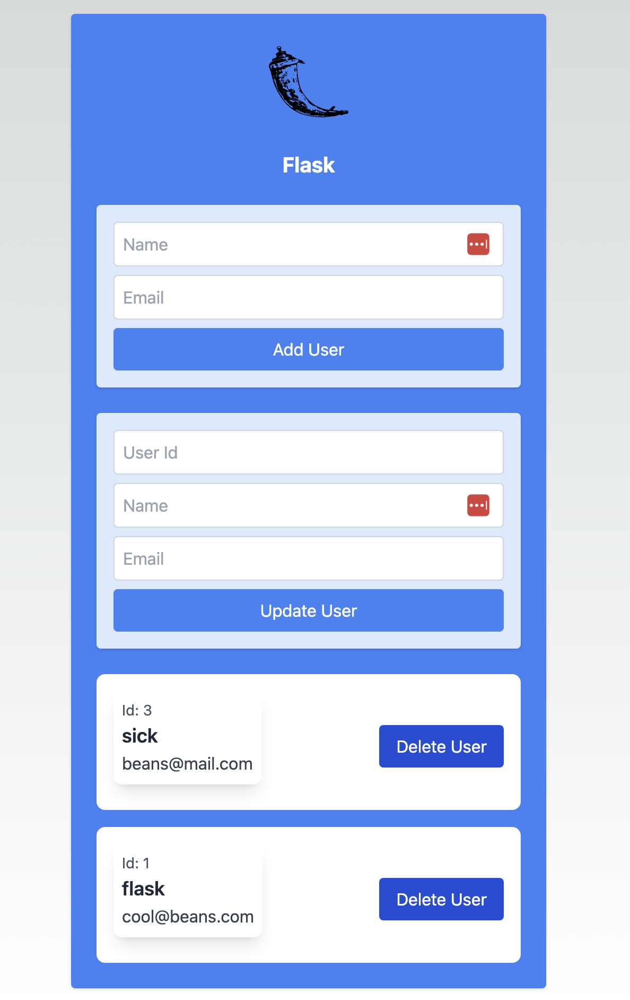

# python-flask-crud
Next.js and Flask Docker Application \
This project demonstrates a web application built with Next.js for the frontend, Flask for the backend, and Docker for containerization. \
The Flask backend uses SQLAlchemy for database interactions and connects to a PostgreSQL database.

## Table of Contents
1. [Project Structure](#project-structure)
2. [Setup and Installation](#setup-and-installation)
3. [Running the Application](#running-the-application)
4. [API Endpoints](#api-endpoints)
    - [Create a User](#create-a-user)
    - [Get All Users](#get-all-users)
    - [Get a User by ID](#get-a-user-by-id)
    - [Update a User](#update-a-user)
    - [Delete a User](#delete-a-user)
5. [Environment Variables](#environment-variables)
    - [Frontend (Next.js)](#frontend-nextjs)
    - [Backend (Flask)](#backend-flask)
    - [Database (PostgreSQL)](#database-postgresql)
6. [Docker Compose Configuration](#docker-compose-configuration)
7. [Volume Configuration](#volume-configuration)
8. [Screenshot of Application](#screenshot-of-application)

## Project Structure
```java
.
├── backend
│   ├── app.py
│   ├── Dockerfile
│   └── requirements.txt
├── frontend
│   ├── pages
│   ├── public
│   ├── styles
│   ├── Dockerfile
│   └── package.json
├── docker-compose.yml
└── README.md
```

## Setup and Installation
Clone the repository:

```bash
git clone https://github.com/yourusername/your-repo-name.git
cd your-repo-name
```

Navigate to the backend directory and install dependencies:

```bash
cd backend
pip install -r requirements.txt
```
Navigate to the frontend directory and install dependencies:

```bash
cd ../frontend
npm install
```

## Running the Application
To run the application, you will use Docker Compose to build and start all services.

Build and start the services:

```bash
docker-compose up --build
```
Access the application:

Frontend: http://localhost:3000
Backend API: http://localhost:4000/api/flask/users

## API Endpoints

### Create a User
    URL: /api/flask/users
    Method: POST
    Payload:

```json
{
  "name": "John Doe",
  "email": "john.doe@example.com"
}
```

### Get All Users
    URL: /api/flask/users
    Method: GET

### Get a User by ID
    URL: /api/flask/users/<id>
    Method: GET

### Update a User
    URL: /api/flask/users/<id>
    Method: PUT

### Payload:

```json
{
  "name": "John Doe Updated",
  "email": "john.doe.updated@example.com"
}
```

### Delete a User
    URL: /api/flask/users/<id>
    Method: DELETE
    
### Environment Variables
    Frontend (Next.js)
        NEXT_PUBLIC_API_URL: URL of the Flask API (e.g., http://localhost:4000)
    
    Backend (Flask)
        DATABASE_URL: Connection URL for the PostgreSQL database (e.g., postgresql://postgres:postgres@db:5432/postgres)
    
    Database (PostgreSQL)
        POSTGRES_USER: Username for PostgreSQL (e.g., postgres)
        POSTGRES_PASSWORD: Password for PostgreSQL (e.g., postgres)
        POSTGRES_DB: Database name (e.g., postgres)

## Docker Compose Configuration
Here’s the docker-compose.yml configuration:

```yaml
version: '3'
services:
  nextapp:
    container_name: nextapp
    image: nextapp:1.0.0
    build:
      context: ./frontend
      dockerfile: Dockerfile
    ports:
      - 3000:3000
    environment:
      - NEXT_PUBLIC_API_URL=http://localhost:4000
    depends_on:
      - flaskapp

  flaskapp:
    container_name: flaskapp
    image: flaskapp:1.0.0
    build:
      context: ./backend
      dockerfile: Dockerfile
    ports:
      - 4000:4000
    environment:
      - DATABASE_URL=postgresql://postgres:postgres@db:5432/postgres
    depends_on:
      - db

  db:
    container_name: db
    image: postgres:13
    environment:
      POSTGRES_USER: postgres
      POSTGRES_PASSWORD: postgres
      POSTGRES_DB: postgres
    ports:
      - 5432:5432
    volumes:
      - pgdata:/var/lib/postgresql/data

volumes:
  pgdata: {}
```
## Volume Configuration
### Docker Volumes
pgdata: Used to persist PostgreSQL data across container restarts.

## Screenshot of Application

